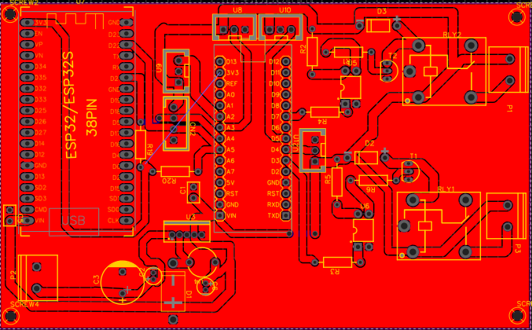
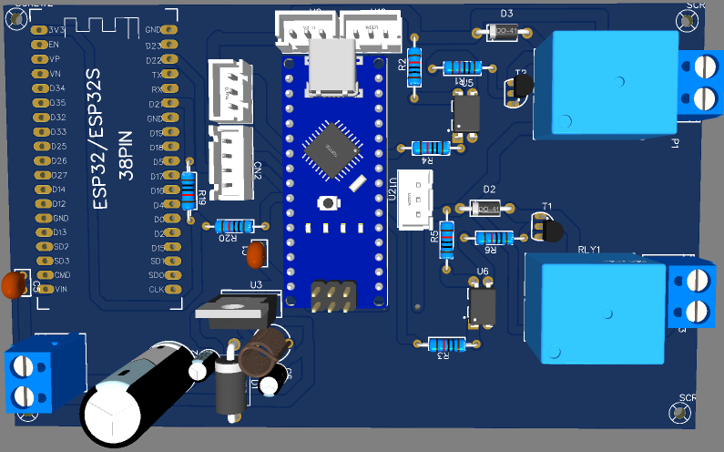

# Smart Irrigation System


A smart irrigation monitoring and control system built with ESP32, Arduino/PlatformIO, I2C communication, HMI display support, and ThingSpeak cloud monitoring.

## Overview

This project collects irrigation-related sensor data, transfers readings between embedded controllers, and uploads the data to ThingSpeak for real-time visualization. It is designed as a modular embedded system with separate firmware for the controller, cloud gateway, and HMI display.

## Features

- Sensor data monitoring for irrigation applications
- ESP32-based controller and gateway architecture
- I2C communication between system modules
- ThingSpeak cloud data upload
- HMI display interface support
- Relay state monitoring for irrigation control
- PCB schematic and Gerber files included
- Secrets separated from source code before publishing

## System Architecture

```text
Sensors -> Master Controller -> I2C -> Cloud Gateway -> ThingSpeak
                         |
                         v
                    HMI Display
```

See the full architecture guide: [docs/architecture.md](docs/architecture.md)

## Project Structure

```text
Smart-Irrigation-System/
├── firmware/
│   ├── master_controller/     # Main controller firmware
│   ├── cloud_gateway/         # ESP32 gateway + ThingSpeak upload
│   └── hmi_display/           # ESP32 HMI display firmware and UI files
├── docs/
│   ├── architecture.md
│   ├── setup.md
│   ├── hardware.md
│   └── hardware/              # Schematic and Gerber files
├── assets/
│   ├── images/                # PCB previews and screenshots
│   └── demo/                  # Demo videos or GIFs
├── tools/                     # Utility scripts
├── .gitignore
├── CONTRIBUTING.md
├── LICENSE
└── README.md
```

## Dashboard / Hardware Preview

| PCB Preview | PCB 3D Preview |
|---|---|
|  |  |

## Getting Started

### 1. Clone the repository

```bash
git clone https://github.com/YOUR_USERNAME/Smart-Irrigation-System.git
cd Smart-Irrigation-System
```

### 2. Configure credentials

Copy the example config file:

```bash
cp firmware/cloud_gateway/config.example.h firmware/cloud_gateway/config.h
```

Edit `firmware/cloud_gateway/config.h`:

```cpp
#define WIFI_SSID "your_wifi_name"
#define WIFI_PASSWORD "your_wifi_password"
#define THINGSPEAK_WRITE_API_KEY "your_thingspeak_write_api_key"
```

> `config.h` is ignored by Git to prevent accidental exposure of WiFi credentials and API keys.

### 3. Upload firmware

Open the required firmware folder in Arduino IDE or PlatformIO and upload to the target ESP32 board.

Recommended upload order:

1. `firmware/master_controller/master_controller.ino`
2. `firmware/cloud_gateway/cloud_gateway.ino`
3. `firmware/hmi_display/ESP_CYD_DHT_Master_iteration4_SIMPLE_V2.ino`

### 4. Monitor serial output

Use `115200` baud rate for serial monitoring.

## ThingSpeak Integration

The cloud gateway sends data to:

```text
http://api.thingspeak.com/update
```

Mapped fields:

| ThingSpeak Field | Description |
|---|---|
| Field 1 | Sensor value `s` |
| Field 2 | Sensor value `L` |
| Field 3 | Temperature |
| Field 4 | Humidity |
| Field 5 | Potentiometer / threshold |
| Field 6 | Relay 1 state |
| Field 7 | Relay 2 state |

## Documentation

- [Setup Guide](docs/setup.md)
- [System Architecture](docs/architecture.md)
- [Hardware Documentation](docs/hardware.md)

## Security Notice

The original uploaded code contained WiFi and ThingSpeak credentials. These have been moved to `config.example.h`. Before pushing to GitHub, rotate the old ThingSpeak Write API Key and avoid committing real credentials.

## Roadmap

- Add automatic pump control logic
- Add soil moisture calibration guide
- Add live ThingSpeak dashboard screenshots
- Add demo video or animated GIF
- Add PlatformIO multi-environment configuration
- Add mobile/web dashboard integration

## Contributing

Pull requests are welcome. See [CONTRIBUTING.md](CONTRIBUTING.md).

## License

This project is licensed under the MIT License.
